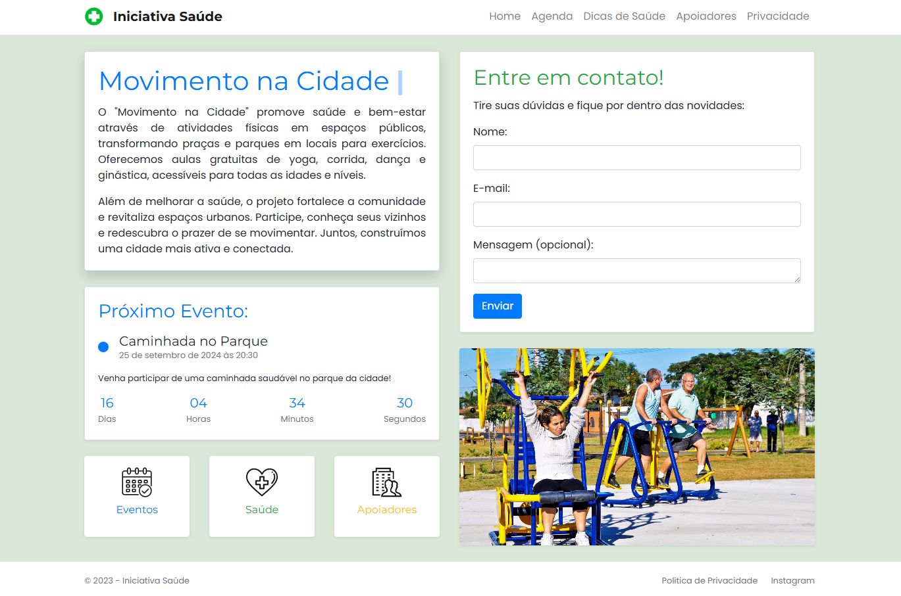
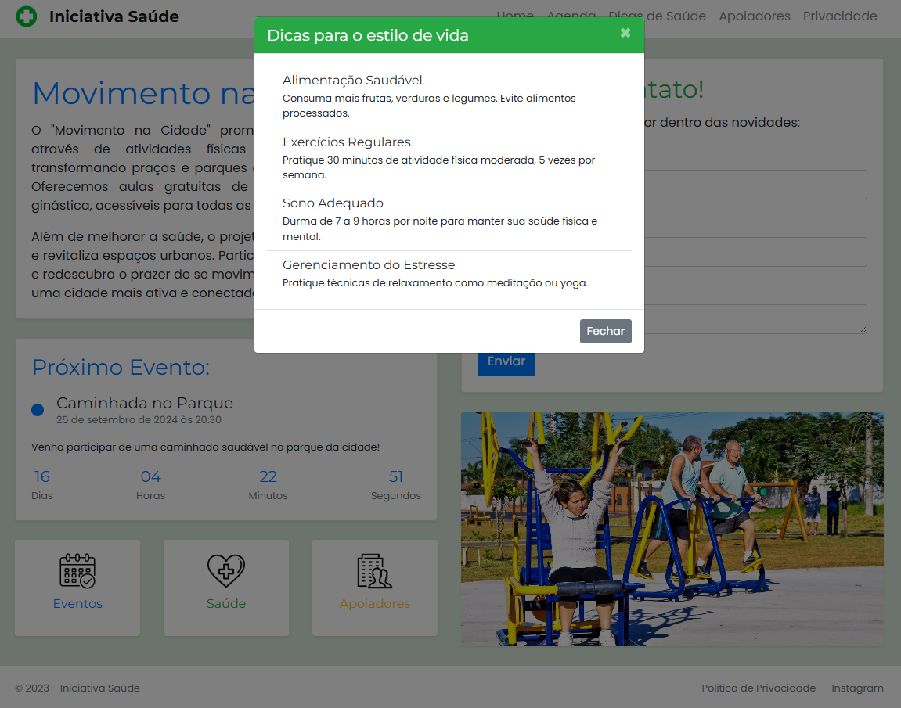
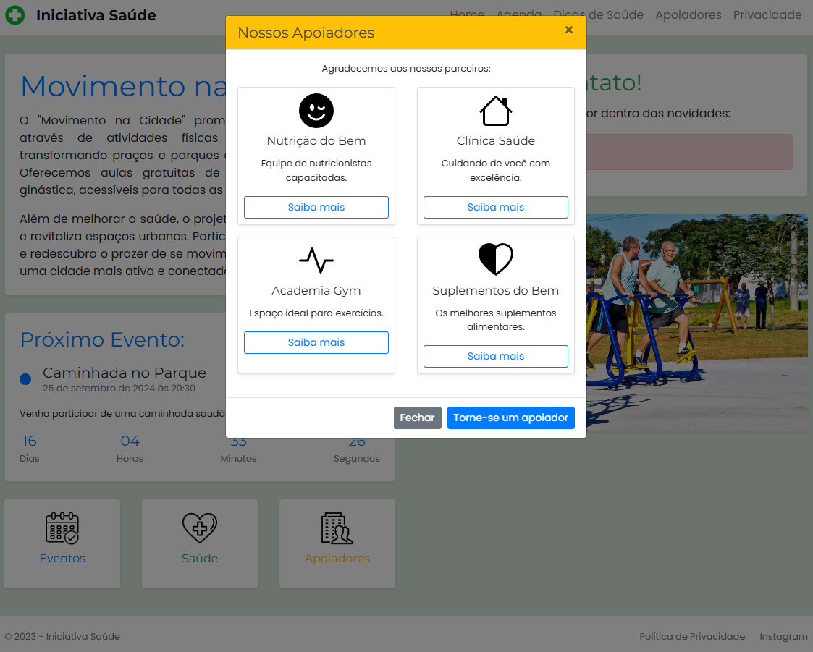
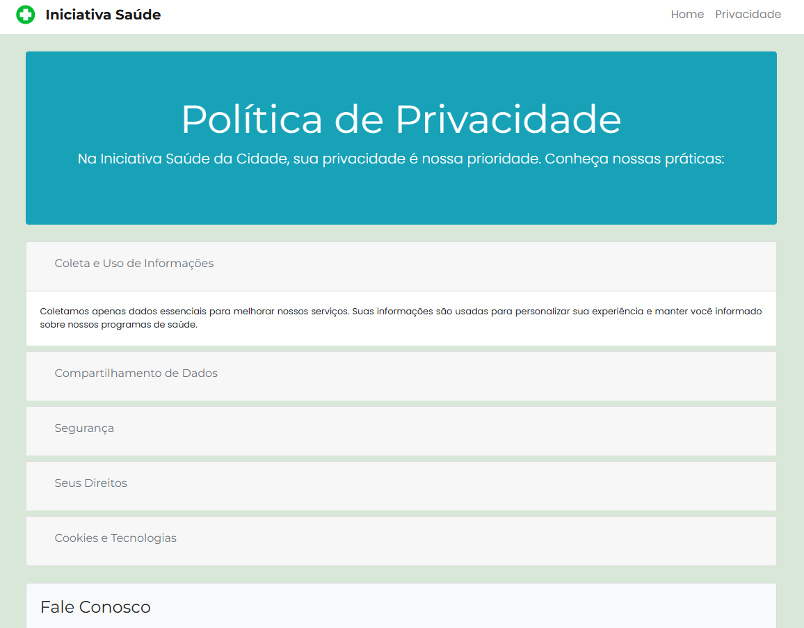
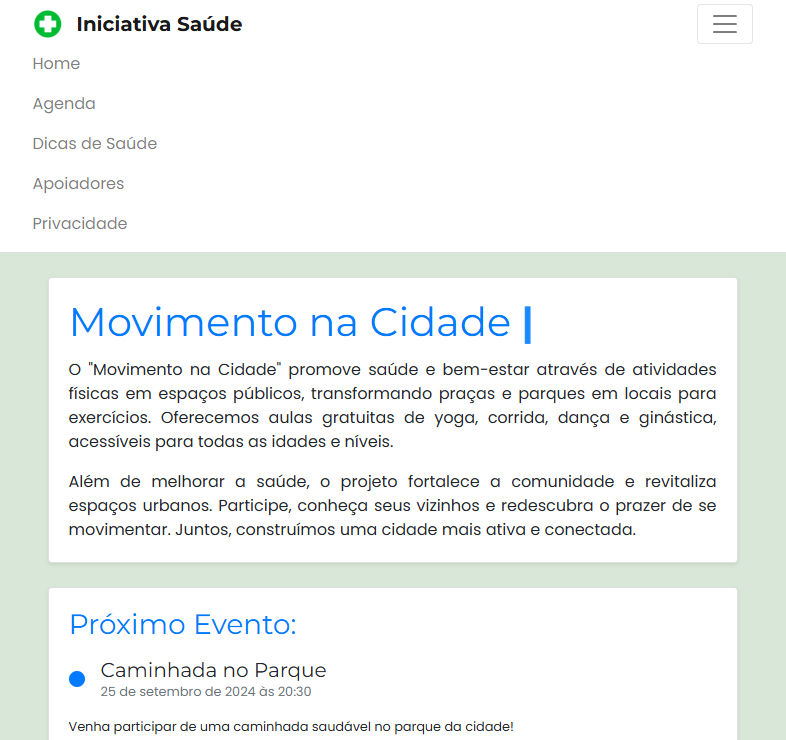
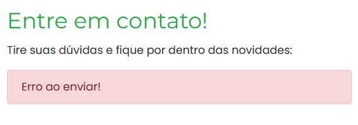
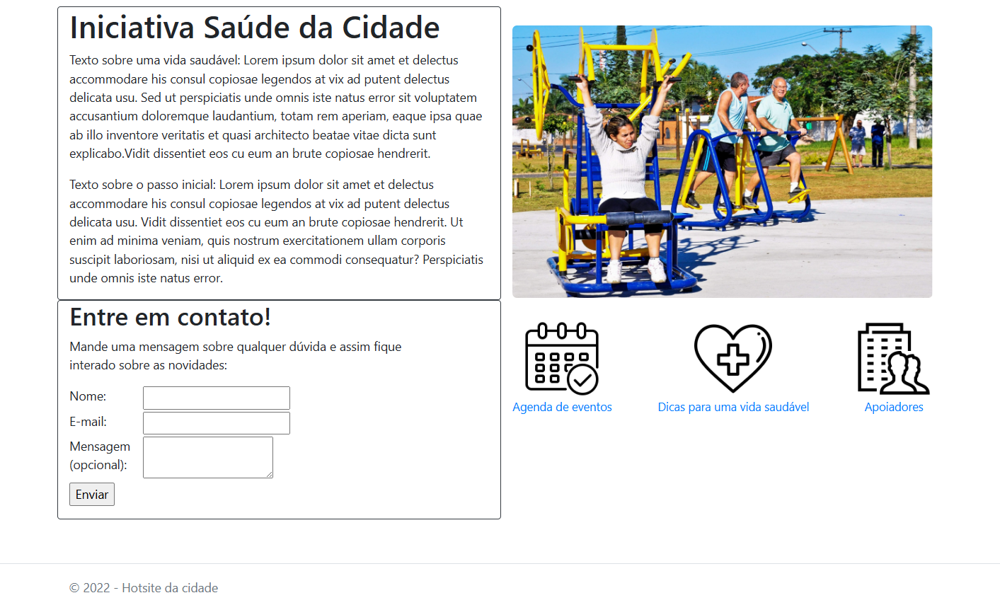

<!-- Projeto Finalizado -->
# 🏙️ Iniciativa Saúde 2.0
<p align="center">
  <!-- Contador de linguagens do GitHub -->
  
  <!-- Tamanho do repositório no GitHub -->
  
  <!-- Último commit no GitHub -->
  
</p>

<div align="center">
  
</div>

## 📋 Sobre o Projeto
Este projeto, inicialmente desenvolvido durante um curso técnico do **Senac**, foi recentemente atualizado e expandido. A **Iniciativa Saúde da Cidade 2.0** é uma aplicação web que promove saúde e bem-estar urbano através do "Movimento na Cidade", oferecendo informações sobre eventos de atividades físicas de uma cidade fictícia, dicas de saúde e patrocinadores do movimento.

## 🆕 Novidades na Versão 2.0
- **Sistema de Eventos Dinâmico**: Implementação de um sistema de gerenciamento de eventos automático.
- **Animações Interativas**: Adição de efeitos de digitação e contagem regressiva dos eventos.
- **Modais Informativos**: Inclusão de modais para agenda, dicas de saúde e apoiadores.
- **Design Responsivo Aprimorado**: Interface totalmente renovada com Bootstrap.

## ⚙️ Funcionalidades Principais
- **Exibição e gerenciamento de eventos de atividades físicas**.
- **Sistema de dicas de saúde e estilo de vida**.
- **Formulário de contato interativo**.
- **Countdown dinâmico para o próximo evento**.
- **Seção de apoiadores do projeto**.

## 🛠 Tecnologias Utilizadas
- **Backend**: ASP.NET Core MVC, Entity Framework Core
- **Frontend**: HTML5, CSS3, JavaScript, Bootstrap
- **Banco de Dados**: MySQL
- **Outras**: Font Awesome para ícones

```
## 📂 Estrutura do Projeto
├── src/                                    # Diretório principal do código-fonte
│   ├── css/                                # Arquivos de estilo CSS
│   │   ├── responsive.css                  # Estilos para responsividade
│   │   └── style.css                       # Estilos principais
│   └── js/                                 # Scripts JavaScript
│       ├── app.js                          # Lógica principal da aplicação
│       ├── data.js                         # Gerenciamento de dados
│       ├── menu.js                         # Funcionalidades do menu
│       └── theme.js                        # Gerenciamento de temas
├── index.html                              # Página principal do projeto
└── README.md                               # Documentação do projeto
```

## 🚀 Como Executar o Projeto
1. **Clone o repositório**:
   ```bash
   git clone https://github.com/devAndreotti/healthy-city-mvc.git
   ```
2. **Restaure as dependências**:
   ```bash
   dotnet restore
   ```
3. **Inicie a aplicação**:
   ```bash
   dotnet run
   ```

## 🔮 Planos Futuros
- [ ] **Adição do banco de dados em SQL, utilizando MySQL Workbench para o devido funcionamento**
- [ ] **Implementação de um sistema de login para usuários**.
- [ ] **Sistema de avaliação e feedback para eventos realizados**.
- [ ] **Criação de perfis de usuário com histórico de participação em eventos**.

## 🔄 Versão 2.0
<div align="center">
  
  
  
  
  
</div>

## 🔄 Versão 1.0
<div align="center">
  
</div>

## 💪 Como Contribuir
Contribuições são bem-vindas! Siga estas etapas para colaborar:
1. Faça um fork do projeto.
2. Crie uma nova branch para sua feature: `git checkout -b feature/nome-feature`.
3. Commit suas mudanças: `git commit -m 'Adiciona nova feature'`.
4. Envie para a branch: `git push origin feature/nome-feature`.
5. Abra um Pull Request.

## 📝 Nota
Este projeto começou como uma atividade técnica e foi aprimorado ao longo do tempo. A versão atual reflete um esforço contínuo para melhorar a funcionalidade e a usabilidade da aplicação.

<br>

---
<p align="center"> Desenvolvido por <a href="https://github.com/devAndreotti">Ricardo Andreotti Gonçalves</a> </p>
